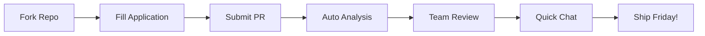

# 🚀 RAD Team - Ship-Every-Friday Squad

**We ship to millions every Friday. Join us.**

## 🎯 The Mission

We're building a **Ship-Every-Friday** Rapid Application Deployment squad for our OTT platform. We need MERN + Python developers who treat GenAI tools—Cursor, Claude, Codeium, whatever—as first-class teammates.

### 🏃‍♂️ How We Roll

```
Monday:    🧠 Brainstorm & Plan
Tuesday:   💻 Code with AI teammates  
Wednesday: 🔧 Build & Test
Thursday:  🚀 Final push & QA
Friday:    🎉 SHIP TO PROD & TOAST! 🍻
```

**One-week sprints. Every week. No exceptions.**

## 💪 What Makes This Different

- **Direct Impact**: Your code reaches millions within minutes
- **Real Features**: Ship production features every single week
- **AI-First Development**: GenAI isn't a nice-to-have, it's how we build
- **Weekly Wins**: Ship real features every single Friday
- **Meme-Powered Culture**: We work hard, ship harder, and celebrate hardest

## 🔍 What We're Looking For

### The Only Things That Matter:

1. **📊 Your GitHub Profile**
   - Real commits and pull requests tell your story
   - We analyze your actual code, not your résumé
   - Open source contributions = huge plus

2. **🤖 GenAI Tool Mastery**
   - Cursor, Claude, Copilot, Codeium - show us you use them
   - AI-assisted development is our default mode
   - The more tools you use, the better

3. **🛠️ Tech Stack Alignment**
   - MERN (MongoDB, Express, React, Node.js)
   - Python for backend services
   - Testing frameworks (because millions will use your code)
   - Telemetry & monitoring experience

4. **🚢 Shipping Mentality**
   - Can you turn caffeine and AI into weekly production pushes?
   - Do you thrive under "ship every Friday" pressure?
   - Are you ready to see your code in prod within days?

## 📊 Automated Analysis

Our system automatically:
- ✅ Analyzes your GitHub contribution graph
- ✅ Detects GenAI tool usage in your projects
- ✅ Scores your open source contributions
- ✅ Evaluates your code quality and documentation
- ✅ Checks for production-ready mindset (tests, CI/CD, monitoring)

## 🏆 Current Squad Stats

| Metric | Value |
|--------|-------|
| Features Shipped Last Month | 47 |
| Average Deploy Time | 12 minutes |
| Production Incidents | 0.3% |
| Friday Toasts | 100% |
| AI Tools in Stack | 7+ |

## 🎮 The Application Process



## 🏷️ Application Labels

- 🚀 `ready-to-ship` - Can start immediately
- 🤖 `ai-power-user` - Masters of GenAI tools
- 🌟 `oss-contributor` - Active in open source
- 💯 `prod-ready` - Writes tested, monitored code
- 🔥 `high-velocity` - Ships fast and often

---

**Ready to merge, deploy, and high-five in prod?**

Fork this repo and submit your application. The team is waiting to find the next shipping superstar! 

📚 **[See HOW_TO_APPLY.md for detailed step-by-step instructions](HOW_TO_APPLY.md)** 🚀
